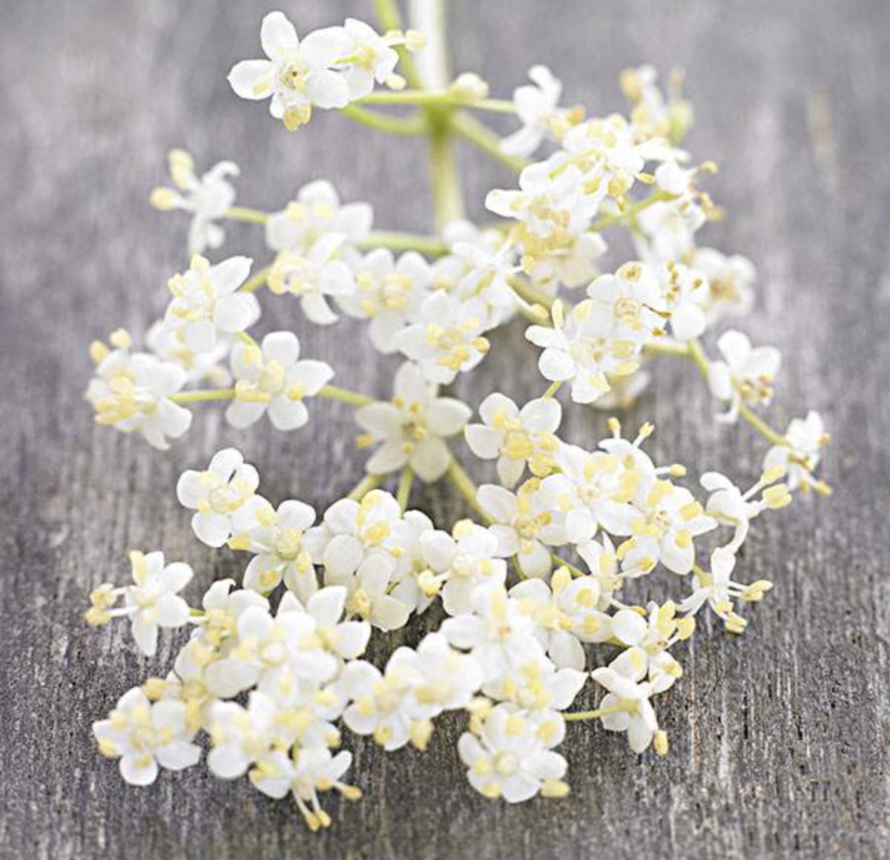
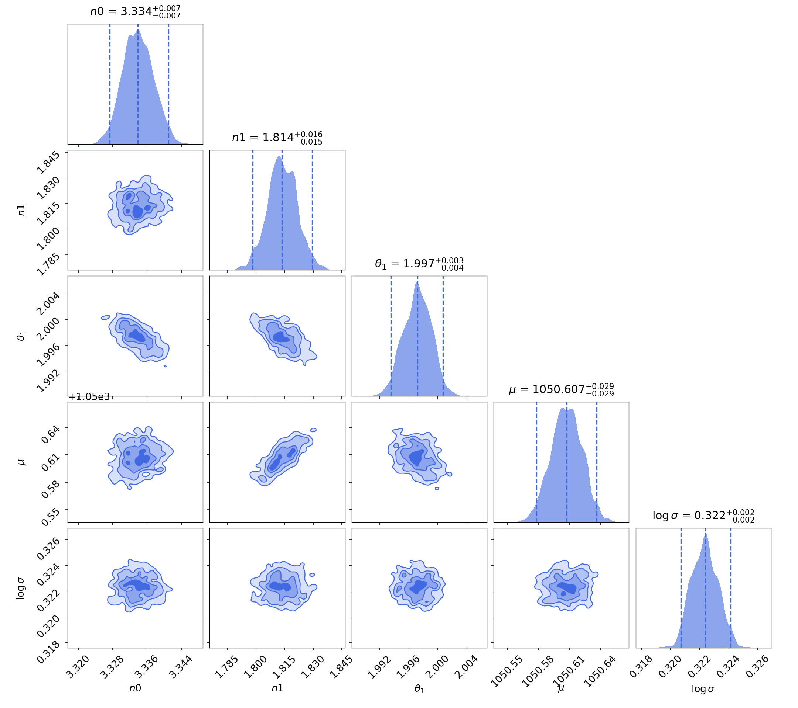

# elderflower



**ELDERFLOWER** (Mod**EL**ling Wi**DE**-Angle Point Sp**R**ead **F**unction in **LOW** Surfac**E** B**R**ightness) is a wide-angle PSF modeling tool for low-surface brightness imaging with Dragonfly that utilizes [Galsim](https://github.com/GalSim-developers/GalSim) and [Dynesty](https://github.com/joshspeagle/dynesty).


Doucmentation: https://elderflower.readthedocs.io/en/latest/

[](https://zenodo.org/badge/latestdoi/197442211)

Installation
------------

```bash
  cd <install directory>
  git clone https://github.com/NGC4676/elderflower.git
  cd elderflower
```

Install ``galsim``. The optimal way is via conda:

```bash
  conda install -c conda-forge galsim
```

Install other dependencies:

```bash
pip install -r requirements.txt
```

Optionally install the high performance compiler package ``numba``:
```bash
pip install numba
```

Install elderflower
```bash
  pip install -e .
```

To fully run the process, SExtractor is needed to be installed. See documentation for details about installation.

Basic Usage
-----------
1. Function mode
```python
bounds = ([100,100,700,700])
obj_name = 'test'
band = 'r'

ZP = Run_Detection('cutout.fits', obj_name, band)
Match_Mask_Measure('cutout.fits', bounds, obj_name, band,
                    ZP=ZP, pixel_scale=2.5)
samplers = Run_PSF_Fitting('cutout.fits', bounds, obj_name, band,
                            n_spline=3, ZP=ZP, pixel_scale=2.5)   
```

2. Configuration mode
```python
from elderflower.task import berry

bounds = ([100,100,700,700])
elder = berry('cutout.fits', bounds,
              obj_name='test', band='r',
              config_file='config.yaml')
elder.detection()
elder.run()
```

The output will be saved as a ``.res`` pickle.
See doucementaton for paramter extraction and bright star subtraction.

Examples
--------
The following example shows a simple 2-component PSF model (+ sky) by running elderflower on a 33'x33' cutout of the Dragonfly image:



elderflower can be used for bright star subtraction. The following example shows the bright star subtraction in a cutout of the Dragonfly NGC3432 field.


