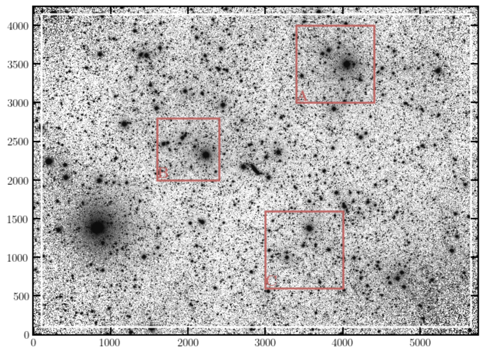

Examples
========

Here we show some examples of how ``elderflower`` works. The data is from the Dragonfly telescope. The examples below are run in the functional way, but they can be run in the same manner by feeding a configuration file with the keyword parameters replaced.

NGC3432
-------

This example illustrates fitting multiple regions in an image. The data is the combined image of the NGC3432 field as part of the Dragonfly nearby edge-on galaxy survey.

.. code-block:: python

	obj_name = 'NGC3432'
	work_dir = './NGC3432/'
	filt = 'r'

	fn  = 'NGC3432/coadd_SloanR_NGC_3432_new.fits'
	bounds = ((3400, 3000, 4400, 4000),
		  (1600, 2000, 2400, 2800),
		  (3000, 600, 4000, 1600))

	Run_Detection(fn, obj_name, filt,
	              threshold=5, work_dir=work_dir,
	              ZP_keyname='REFZP', ZP=None)

	Match_Mask_Measure(fn, bounds, obj_name, band="R",
					ZP=27.15, field_pad=100, pixel_scale=2.5,
					use_PS1_DR2=False, work_dir=work_dir)

.. image:: images/NGC3432A_pdf.png
	:align: center

.. image:: images/NGC3432A_2d.png
	:align: center

