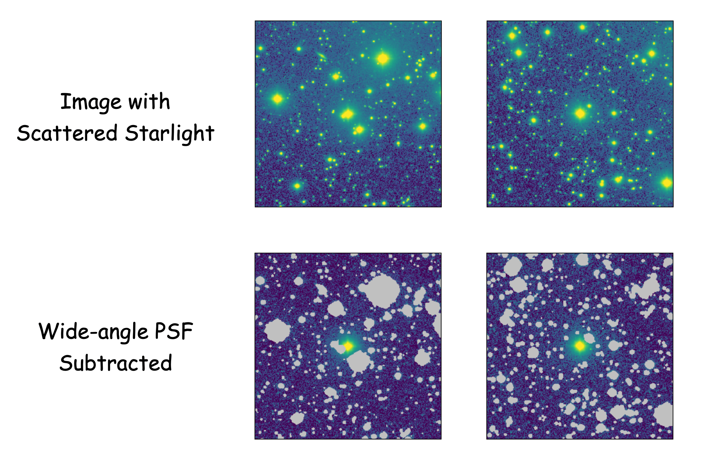

Examples
========

Here we show applications of ``elderflower``. The data is from the Dragonfly telescope.

1. Build Wide-PSF Model from parameters
---------------------------------------

A 2D image of the PSF can be created directly with the fitted parameters::

	from elderflower import utils
	image_psf, psf = utils.make_psf_2D(n_s, theta_s, frac, beta, fwhm, psf_range=1200, pixel_scale=pixel_scale)

Note theta and fwhm are in arcsec. ``image_psf`` is a 2D array of the wide PSF normalized to have sum of 1 and ``psf`` is an ``elderflower.modeling.PSF_Model`` object.

This parametric wide-angle PSF model can be combined with PSF from other measurements, e.g. a  PSF obtained from stacking techniques. Note stacking multi-epoch data has the risk of smearing out the temporal variability of the PSF, especially in the extended wing, which is one motivation of inferring an `instantaneous` PSF from the image itself, as ``elderflower`` does.

To replace the parametric core in the model built above with a non-parametric core::

	image_PSF = utils.montage_psf_image(image_psf_core, image_psf, r=10)

The core and the aureole are stitched at ``r=10``. Here ``image_psf_core`` is the image of the inner PSF. Note it requires to have odd dimensions. An utility to map the asymmetry and high-order features of the inner PSF (e.g., ellipticity, position angle, spikes) is under implementation.

``elderflower`` produces a decent stacking of unsaturated bright stars within the region(s), which is stored in ``work_dir``. The accuracy, however, may not be very high if one needs high precision as well on small scales. The user can turn to the `mrf <https://mrfiltering.readthedocs.io/en/latest/index.html>`__ package, where the inner PSF is treated more carefully, or replace with their own measurements. 

2. Apply Wide-PSF Subtraction on Image
--------------------------------------

At ultra-low surface brightness levels, the scattered light might pervade the entire field, affecting *every* pixel on the image. A few percetage of difference in ADU might not be important for normal photometry, but it could matter a lot below 30 mag/arcsec^2.

Therefore, one practical application of our PSF model is to eliminate the scattering starlight on the image. 

The following figure illustrate why such subtraction is important and how good we can achieve in a scenario where scattered light from bright stars are dominant. The subtraction is done for all bright stars except the central one (the traget). The data is from the open cluster M44, which suffers much that makes it visible to eyes, but normal fields would have the same kind of issue.

In the tutorial we have obtained a PSF model ``psf``. This output PSF can be applied on a broader region of the image and build a model of bright stars. For example, we would like to use our fitted PSF above to subtract the bright stars in a broader region in the original NGC3432 image (the image will be released soon with an upcoming paper, Gilhuly et al. submitted). To do so we first read the Image into an ``Image`` class::
	
	from elderflower.image import Image
	DF_Image = Image('coadd_SloanR_NGC_3432_new.fits', 
			(1500, 1500, 3000, 3000), 'test', 'r',
			pixel_scale=2.5, pad=0, ZP=27.15, bkg=1049)

It can be quickly visualized by calling ``DF_Image.display()``. 

We also need the SExtractor catalog and segmentation map of the full image. These are products of ``Run_Detection`` but can be generated separately::

	from astropy.table import Table
	SE_catalog = Table.read('NGC3432-g.cat', format="ascii.sextractor")
	seg_map = fits.getdata('NGC3432-g_seg.fits')

The image of bright stars can then be created by simply running::

	image_stars = DF_Image.generate_image_psf(psf, SE_catalog, seg_map)

The function does all the steps in the modeling but will adopt the given PSF model, you can control the brightness thresholds with ``mag_threshold`` and the scale radius ``r_scale`` used to measure the normalization. As flux-based normalization suffers from saturation, we use intensity.

It might take a bit of time to generate segmentation for a wide area if set ``make_segm=True``.

To see how the subtraction works, let's draw the original image, the image of bright stars (``image_stars``) and the residual::

	from elderflower.plotting import LogNorm
	fig, (ax1,ax2,ax3) = plt.subplots(1,3,figsize=(22,7))
	ax1.imshow(DF_Image.image, norm=LogNorm(vmin=1049, vmax=1149))
	ax1.set_title('IM1: Data')
	ax2.imshow(image_stars, norm=LogNorm(vmin=0, vmax=100))
	ax2.set_title('IM2: Bright Stars')
	ax3.imshow(DF_Image.image-image_stars, norm=LogNorm(vmin=1049, vmax=1149))
	ax3.set_title('IM1 - IM2')

.. image:: images/subtract_stars_by_psf.png
	:align: center

