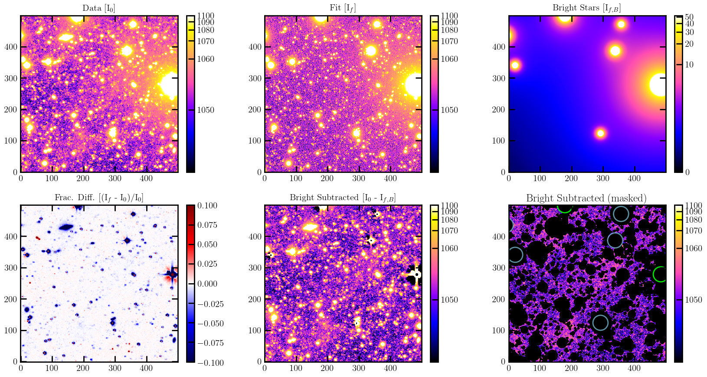

Tutorial
========

This chapter illustrates how to run the wide angle PSF fitting using ``elderflower``. ``elderflower`` can be run in two ways: in a functional way or thourough a ``yaml`` configuration file. We use a 800x800 cutout image in the test directory (``test/cutout.fits``) as an example. The data is observed by the Dragonfly telescope with the SloanR band filter.

We first set out the object name, the working directory and the filter in use::

	obj_name = 'test'
	work_dir = './test/'
	filt = 'r'

The object name can be arbitrary which is used for labeling. The working directory is where the fitting stores intermediate files and the fitting outputs. The filter is the band at which it will match with in the PANSTARRS star catalog. Available filters are 'g' or 'r' (note: case-insensitive).

Next we define the boundaries of the region intended to fit (patch):: 

	bounds = ([100,100,700,700])

The boundaries have the format of (in pixel coordinates):
	*[X min, Y min, X max, Y max]*

Multiple boundaries can be passed in sequence as an Nx4 list or turples. 

The following procedure can be run with functions step-by-step or through a configuration file.

1. Run with functions
---------------------

(1) Detection
+++++++++++++

We first import the functions from ``elderflower.task``:

.. code-block:: python
	
	from elderflower.task import Run_Detection, Match_Mask_Measure, Run_PSF_Fitting

The package will search the location of SExtractor automatically. The user can also specify the path of the SExtractor executable, e.g.::

    SE_executable = '/opt/local/bin/source-extractor'

The path can be retrieved by running ``which sex`` or ``which source-extractor``. Make sure the correct SExtractor path is given, otherwise it will exit. 

``Run_Detection`` will then run SExtractor to generate a catalog for crossmatch ``{obj_name}_cat.fits`` and a first segmentation map ``{{obj_name}}_seg.fits``. 

.. code-block:: python

	ZP = Run_Detection('cutout.fits', obj_name, filt,
			threshold=10, work_dir=work_dir, 
			executable=SE_executable,
			ZP_keyname='REFZP', ZP=None)

The ``MAG_AUTO`` from SExtractor are used to group stars for different treatments according to their brightness. To convert flux into magnitudes it will try to find a zero-point ``ZP_keyname`` in the fits header. Alternatively one can pass a value by ``ZP`` if the value has been computed elsewhere. 

	Note: it will compute the zero-point using functions from ``dfreduce.catalogues``, if neither ``ZP_keyname`` or ``ZP`` is available. In this case either ``ref_cat`` or ``apass_dir`` is required. See API of ``Run_Detection``.

The below steps can be run given a SExtractor ``{obj_name}_cat.fits`` containing the following parameters: 

	NUMBER, X_WORLD, Y_WORLD, FLUXERR_AUTO, MAG_AUTO, MU_MAX, CLASS_STAR, ELLIPTICITY

and a segementation map ``{obj_name}_seg.fits`` in ``work_dir``.

(2) Preparation
+++++++++++++++

``Match_Mask_Measure`` does all the fussy preparatory work, including: 

1) crossmatch stars detected with PANSTARRS;

2) calculate color correction between filters;

3) empirically make up for unmatched stars by correcting saturation; 

4) build a basement mask map for dim stars; 

5) measure brightness ``I(r_scale)`` at a specific radius ``r_scale``:

.. code-block:: python

	Match_Mask_Measure('cutout.fits', 
			   bounds, obj_name, filt,
			   ZP=ZP, pixel_scale=2.5, 
			   r_scale=12, field_pad=50, 
			   use_PS1_DR2=False, 
			   work_dir=work_dir)

The pixel scale of Dragonfly is 2.5 arcsec/pixel. The scaling radius ``r_scale`` is chosen to be out of inner saturation radius. The default value (12 pix, or 0.5 arcmin) works for a 7 mag star in r-band for Dragonfly. For brighter stars, a larger value is required to avoid saturation issue.

``use_PS1_DR2`` decides whether to cross-match with PANSTARRS DR1 (through vizier) or DR2 (through MAST request). The former method is done across the field of view, while the latter is done only for each patch. ``field_pad`` restricts the cross-match with paddings in both edges, which is only used when ``use_PS1_DR2=False``.

	Note: PANSTARRS DR2 contains more entries and more rigorous catalog values but are prone to fail in the query if one of patch is too large (> 0.6x0.6 deg^2). In this case it is recommended to set ``use_PS1_DR2=False``.

``Match_Mask_Measure`` will generate several diagnostic plots if ``draw=True``.

From top to bottom, these are:

1) A panoramic view of the image with intended regions marked in sequence.

2) MU_MAX vs MAG_AUTO to pick out & mask potential extended source

3) Color correction between the image filter and the PANSTARRS filter

4) Saturation corrected MAG_AUTO (MAG_AUTO_corr) vs original MAG_AUTO. Very bright stars missed in the crossmatch are manually added using MAG_AUTO_corr. The correction is more robust with larger/more crowded regions.

5) Log radius (in pixel) of aperture mask vs catalog magnitudes. The apertures are for masking dim stars.

6) Modified segmentation map.

7) 1d profiles of stars < ``mag_limit`` (default: 15 mag). The colors indicate the catalog magnitude.

(3) Fitting
+++++++++++

Finally, ``Run_PSF_Fitting`` does the fitting work:

.. code-block:: python

	samplers = Run_PSF_Fitting('cutout.fits',
				   bounds, obj_name, filt, 
				   mag_threshold=[13.,10.],
				   n_spline=3, n_cpu=4, 
				   ZP=ZP, pad=100, 
				   r_scale=12, r_core=24, 
				   pixel_scale=2.5,
				   use_PS1_DR2=False,
				   work_dir=work_dir)

The PSF model is composed of a central Moffat core and a multi-power law aureole. We use a three component power law for the modeling of the aureole by setting ``n_spline=3``. As ``n_spline`` increases, the time it takes to converge also increases.

Stars with magnitudes 13.5 ~ 10.5 will be modelled as MB ('Meidum bright') stars and rendered as stamps by Galsim in Fourier space. Stars brighter than 10.5 will be modelled as VB ('Very Bright') stars and rendered in real space. 

``r_scale`` and ``pixel_scale`` should be consistent with the previous step. The core part (within ``r_core`` =24 pix) of bright stars will be masked. 

``n_cpu`` specifies the number of CPU in use when parallelization is available.

``pad`` is the padding size accounting for bright stars near or outside borders. The actual region in fit is therefore [X min + pad, Y min + pad, X max - pad, Y max - pad].

Below shows the output cornerplot of the fitted parameters of the PSF aureole.

.. image:: images/Cornerplot2p_test.png
	:align: center

Below shows the output of the fitting (stars + background), the fitted bright stars and the data after subtraction of bright stars.

*Run_PSF_Fitting* returns a list of ``Sampler`` class which contains all the fitting info. Each item corresponds to the region specified in ``bounds`` in sequence.

2. Run with ``config.yaml``
---------------------------

The fitting can also be run with a ``.yaml`` configuration file. The functions are wrapped ino a class ``berry``. Parameters of ``Match_Mask_Measure`` and ``Run_PSF_Fitting`` can be provided through the ``.yaml`` file. In addition, parameters of ``Run_Detection`` can be provided as ``**kwargs`` to ``.detection``.

.. code-block:: python

    from elderflower.task import berry  

    bounds = ([100,100,700,700])
    elder = berry('cutout.fits', bounds,
		  obj_name='test', band='r',
		  work_dir='./test/',
		  config_file='configs/config.yaml') 

    elder.detection(executable=SE_executable)
    elder.run()

It will complete procedures above in the functional way and generate the same outputs.

3. Read fitting results
-----------------------

The fitting results are saved as a pickled file ``.res`` under ``work_dir``. It can be read as a ``Sampler`` class through::

	from elderflower.sampler import Sampler
	sampler = Sampler.read_results('test/test-R-fit2p.res')

One can then plot the PDF by::

	sampler.cornerplot(figsize=(12,12), title_fmt='.3f')

Plotting options can be changed by passing them as ``**kwargs`` of the function in ``dynesty.plotting``. See https://dynesty.readthedocs.io/en/latest/api.html#dynesty.plotting.cornerplot.

To reconstruct the PSF, one can run::

	from elderflower.utils import make_psf_from_fit
	psf, params = make_psf_from_fit(sampler.results)

	psf_core = psf.generate_core()
	psf_aureole, psf_size = psf.generate_aureole(psf_range=1200) # arcsec

The psf can be visualized in 1D or 2D::

	# Draw PSF in 1D
	psf.plot_PSF_model_galsim()

	# Draw PSF in 2D
	image_psf = psf.image_psf.array

	from eldeflower.plotting import LogNorm
	plt.imshow(image_psf, norm=LogNorm(), vmin=1e-8, vmax=1e-5, cmap='viridis')

.. image:: images/reconstruct_psf_test_1d.png
	:scale: 40
	:align: center

.. image:: images/reconstruct_psf_test_2d.png
	:scale: 50
	:align: center

The 2D PSF model can be saved by::

	psf.write_psf_image(image_psf, filename='test/PSF_model_test-R.fits')

To regenerate the fitted image and bright stars::

	from elderflower.io import load_pickle
	stars = load_pickle('test/starsA.pkl')
	sampler.generate_fit(psf, stars)

The fitted image is stored as ``sampler.image_fit`` and image of bright stars is saved as ``sampler.image_stars``. The original image is stored as ``sampler.image``.

4. Apply Subtraction on Image
-----------------------------
The readed PSF can be applied on a broader region of the image and create an image of bright stars with the fitted model. For example, we would like to use our fitted PSF above to subtract the bright stars in a broader region in the original NGC3432 image. To do so we first read the Image into an ``Image`` class::
	
	from elderflower.image import Image
	DF_Image = Image('coadd_SloanR_NGC_3432_new.fits', 
			(1500, 1500, 3000, 3000), 'test', 'r',
			pixel_scale=2.5, pad=0, ZP=27.15, bkg=1049)

The image can be quickly visualized by calling ``DF_Image.display()``. 

We also need the SExtractor catalog and segmentation map of the full image, generated by running ``Run_Detection``::

	from astropy.table import Table
	from astropy.io import fits
	SE_catalog = Table.read('NGC3432.cat', format="ascii.sextractor")
	seg_map = fits.getdata('NGC3432_seg.fits')

The image of bright stars can be created by simply running::

	image_stars = DF_Image.generate_image_psf(psf, SE_catalog, seg_map, draw=False)

To see how the subtraction works, we draw the original image (``DF_Image.image``), the image of bright stars (``image_stars``) and the residual image as below::

	from elderflower.plottting import LogNorm
	fig, (ax1,ax2,ax3) = plt.subplots(1,3,figsize=(22,7))
	ax1.imshow(DF_Image.image, vmin=1049, vmax=1149, norm=LogNorm())
	ax1.set_title('IM1: Data')
	ax2.imshow(image_stars, vmin=0, vmax=100, norm=LogNorm())
	ax2.set_title('IM2: Bright Stars')
	ax3.imshow(DF_Image.image-image_star, vmin=1049, vmax=1149, norm=LogNorm())
	ax3.set_title('IM1 - IM2')

.. image:: images/subtract_stars_by_psf.png
	:align: center